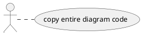

# Architecture Diagrams

This folder contains all 12 architecture diagrams for Smart Solutions by TripleA.

## 📐 Diagrams Overview

### Main Report Diagrams (6)
1. **High-Level Architecture** - Hardware (Pi) + Software (Node) connection
2. **Use Case Diagram** - Admin vs. Operator scope
3. **Real-Time Sequence Diagram** - Event-Driven (WebSocket) logic
4. **Deployment Diagram** - Network setup
5. **UI Sitemap** - Platform scale
6. **User Journey Map** - Productivity problem solution

### Appendix Diagrams (6)
7. **Software Stack Diagram** - Layered view (Frontend/Backend/Data)
8. **Main Sequence Diagram** - System initialization & login flow
9. **Security Flowchart (RBAC)** - Login & role verification logic
10. **Image Optimization Activity Diagram** - Performance optimization logic
11. **Data Schema (JSON)** - Data structure documentation
12. **Code Snippets** - Key algorithms

## 🎨 How to Render Diagrams

### Using PlantText.com (Recommended)

1. Open [PlantText.com](https://www.planttext.com/)
2. Open `PLANTUML-DIAGRAMS.puml` file
3. Find the diagram you need (search for `@startuml Diagram-XX`)
4. Copy the entire diagram block (from `@startuml` to `@enduml`)
5. Paste into PlantText.com editor
6. Click "Generate" to render
7. Export as PNG or SVG

### Example: Rendering Diagram-01

## 📁 Files

- **PLANTUML-DIAGRAMS.puml** - All 12 diagrams in one file
- **01-12-*.md** - Individual markdown documentation for each diagram

## 📝 Diagram Index

| # | Diagram Name | File | PlantUML ID |
|---|--------------|------|-------------|
| 1 | High-Level Architecture | `01-High-Level-Architecture.md` | Diagram-01 |
| 2 | Software Stack | `02-Software-Stack.md` | Diagram-02 |
| 3 | Real-Time Sequence | `03-Sequence-Real-Time-Update.md` | Diagram-03 |
| 4 | Image Optimization | `04-Activity-Image-Optimization.md` | Diagram-04 |
| 5 | Security RBAC | `05-Security-RBAC.md` | Diagram-05 |
| 6 | Data Schema | `06-Data-Schema.md` | Diagram-06 |
| 7 | UI Sitemap | `07-UI-Sitemap.md` | Diagram-07 |
| 8 | Deployment | `08-Deployment.md` | Diagram-08 |
| 9 | Code Snippets | `09-Code-Snippets.md` | Diagram-09 |
| 10 | Use Case | `10-Use-Case.md` | Diagram-10 |
| 11 | User Journey Map | `11-User-Journey-Map.md` | Diagram-11 |
| 12 | Main Sequence | `12-Main-Sequence-System-Init-Login.md` | Diagram-12 |

---

**Total**: 12 diagrams ✅ All complete and ready for thesis submission

